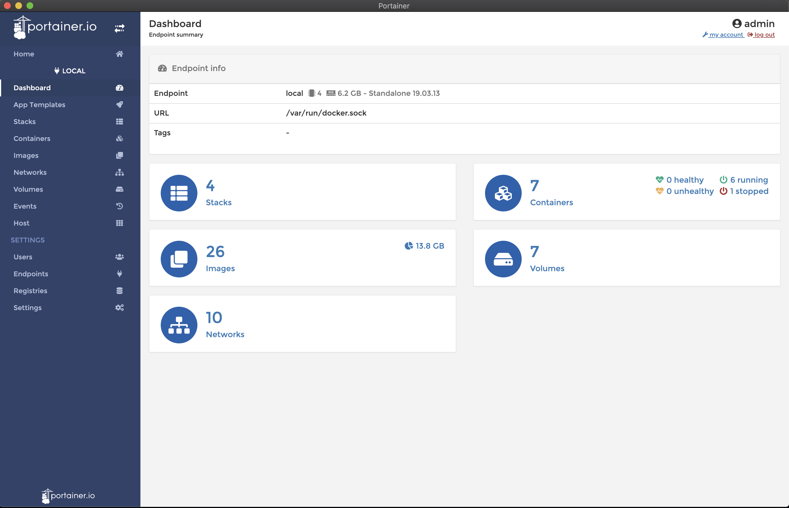

# Portainer Desktop

[Portainer](https://www.portainer.io) PWA Wrapped with `electron.js`. 

## Auto Login

This application has built in auto login for user `admin:password`.

If you want to change the password you can do it in the `main.js` and `docker-compose.yml` file.

## Usage

1. Install Docker and docker-compose
2. Run `docker-compose up -d` <-- this will run a Portainer docker container with user `admin:password`
3. Run `npm install`
4. Run the app with `electron .` or build the app with `electron-builder` OR Download [latest release](https://github.com/ExidCuter/docker-registry-explorer-plugin/releases/latest)

## Trademarks and Copyrights
Portainer.io and the Portainer logo are trademarks or registered trademarks of Portainer.
    
